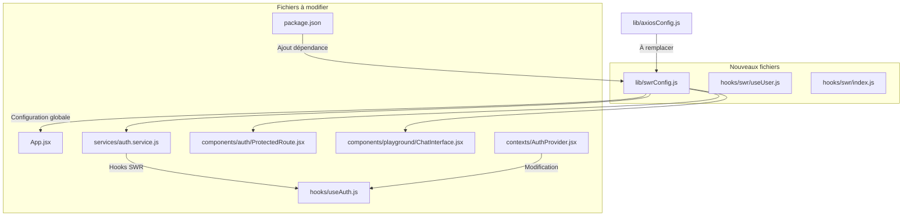

# Diagramme d'implémentation de SWR

```mermaid
graph TD
    A[package.json] -->|Ajout dépendance| B[lib/swrConfig.js]
    B -->|Configuration globale| C[App.jsx]
    
    B --> D[services/auth.service.js]
    D -->|Hooks SWR| E[hooks/useAuth.js]
    
    F[lib/axiosConfig.js] -->|À remplacer| B
    
    B --> G[components/auth/ProtectedRoute.jsx]
    B --> H[components/playground/ChatInterface.jsx]
    
    I[contexts/AuthProvider.jsx] -->|Modification| E
    
    subgraph "Nouveaux fichiers"
        B
        J[hooks/swr/useUser.js]
        K[hooks/swr/index.js]
    end

    subgraph "Fichiers à modifier"
        A
        C
        D
        E
        G
        H
        I
    end
```
